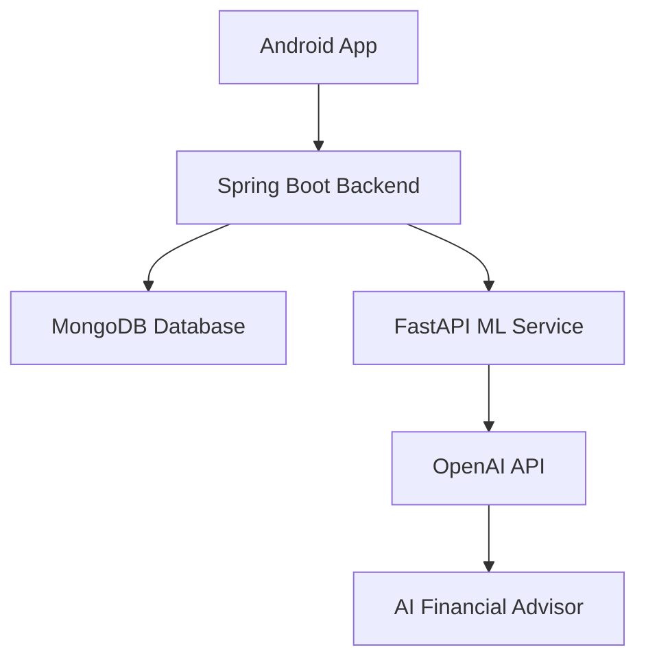
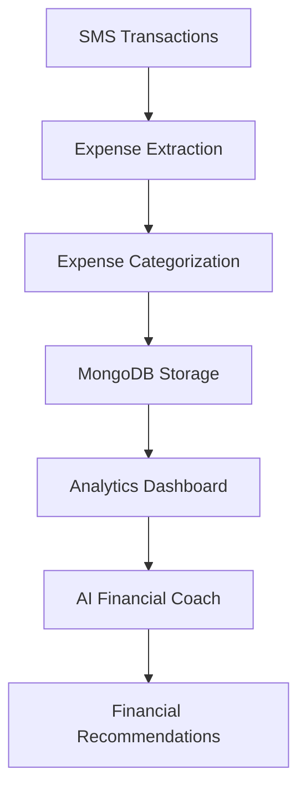

<div align="center">


# WealthWise AI – Financial Freedom for Irregular Income


<br/>

<p align="center">
  
  
  
  
</p>

</div>

---

# About WealthWise AI

WealthWise AI is an intelligent personal finance platform designed specifically for people with irregular income.

Whether you're a:

- Freelancer
- Gig Worker
- Student
- Entrepreneur

WealthWise adapts to your income patterns and helps you:

- Track Expenses
- Predict Future Cash Flow
- Build Savings Automatically
- Receive Personalized Financial Guidance
- Make Smarter Investment Decisions

> Traditional budgeting apps assume stable salaries. WealthWise AI is built for real life.

---

# The Problem

<div align="center">

| Statistics | Numbers |
|------------|----------|
| People with Irregular Income | 150M+ |
| Freelancers Nationwide | 90M+ |
| Apps Built for Variable Income | Almost Zero |

</div>

Most finance apps fail to understand:

- Unpredictable earnings
- Income fluctuations
- Seasonal work patterns
- Financial anxiety caused by unstable cash flow

---

# Our Solution

WealthWise AI uses:

- Artificial Intelligence
- Predictive Analytics
- Machine Learning
- Conversational AI

to provide financial guidance that changes as your income changes.

---

# Core Features

<div align="center">

| Feature | Description |
|---------|-------------|
| AI Financial Coach | Personalized money advice based on spending habits |
| Chat Assistant | 24/7 conversational financial support |
| Smart Dashboard | Visual spending and income insights |
| Proactive Warnings | Alerts before potential financial issues |
| Goal Automation | Adaptive savings and financial planning |
| Gamified Savings | Streaks, rewards, and saving challenges |
| Expense Tracking | Automatic expense categorization |
| Spending Analytics | Real-time expense and balance monitoring |

</div>

---

# Innovation Hub

## Income Volatility Predictor
Measures income stability and predicts risky periods.

## Smart Adaptive Budget
Your budget automatically expands or contracts based on income.

## Buffer Wallet Automation
Save extra money during good weeks and support yourself during low-income periods.

## Expense Guard Mode
Intelligent restrictions on unnecessary spending.

## Predictive Bill Alerts
Know if upcoming bills will become unaffordable.

## Gig Income Planner
Plan work schedules according to expected earnings.

## Auto-Split Buckets
Automatically divide money into:

- Needs
- Savings
- Investments
- Emergency Buffer

## Financial Anxiety Mode
Simple and calming financial insights during difficult times.

## Scenario Simulator
Allows users to test different financial situations before making decisions.

## Cash Flow Calendar
Provides a visual timeline of income and expenses.

---

# AI Advisor Capabilities

The AI Advisor can answer questions like:

- "Where did I spend the most this month?"
- "How can I save more?"
- "What percentage of my income goes toward food?"
- "Can I afford this purchase next week?"
- "What are some investment suggestions based on my spending habits?"

---

# Tech Stack

| Layer | Technology |
|--------|------------|
| Frontend | Kotlin (Android) |
| Backend | Spring Boot (Java) |
| AI Services | Python + FastAPI |
| LLM | OpenAI API |
| Database | MongoDB |
| Model Serving | Uvicorn |

---

# System Architecture



---

# Application Workflow



---

# Screenshots

<p align="center">

  

</p>

---

# Roadmap

- Completed — AI Coach
- Completed — Dashboard
- Completed — Chat Assistant
- Completed — Spending Alerts
- In Progress — Income Volatility Score
- In Progress — Scenario Simulator
- In Progress — Guard Mode
- In Progress — Advanced Insights
- In Progress — Auto Buffer Wallet

---

# Getting Started

### Clone Repository

```bash
git clone https://github.com/Pavan-Mishra/WealthWise-AI.git
cd WealthWise-AI
```

### Start Spring Boot Backend

```bash
mvn spring-boot:run
```

### Start FastAPI Service

```bash
cd backend/src/main/java/com/expensetracker/ml_services
source venv/bin/activate
uvicorn app:app --reload --port 8000
```

---

# Vision

To make financial freedom accessible for everyone with irregular income by combining Artificial Intelligence, Predictive Analytics, and Human-Centered Design.

---

<div align="center">

## WealthWise AI
### Predict • Save • Invest • Grow

Star the repository if you like the project.

</div>
